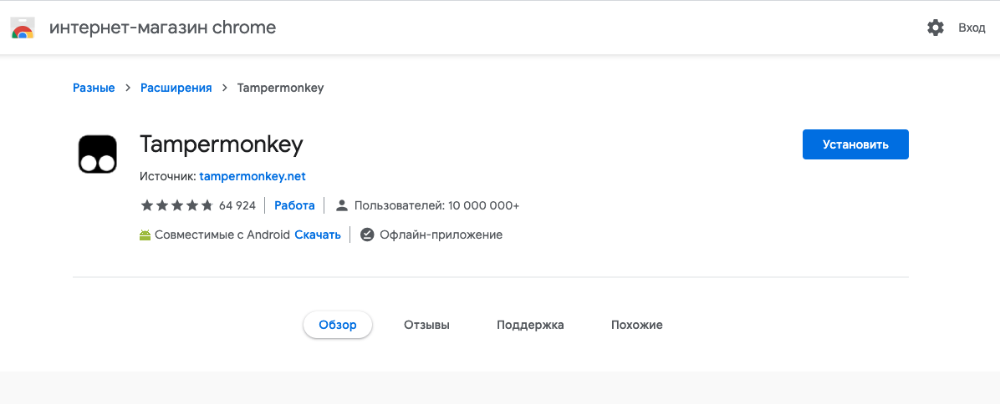
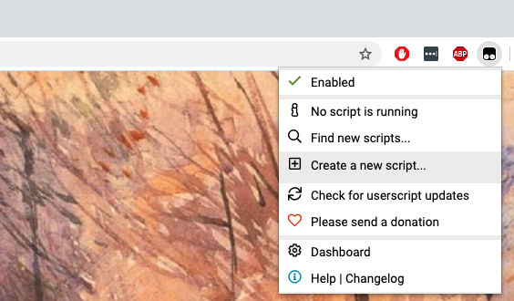
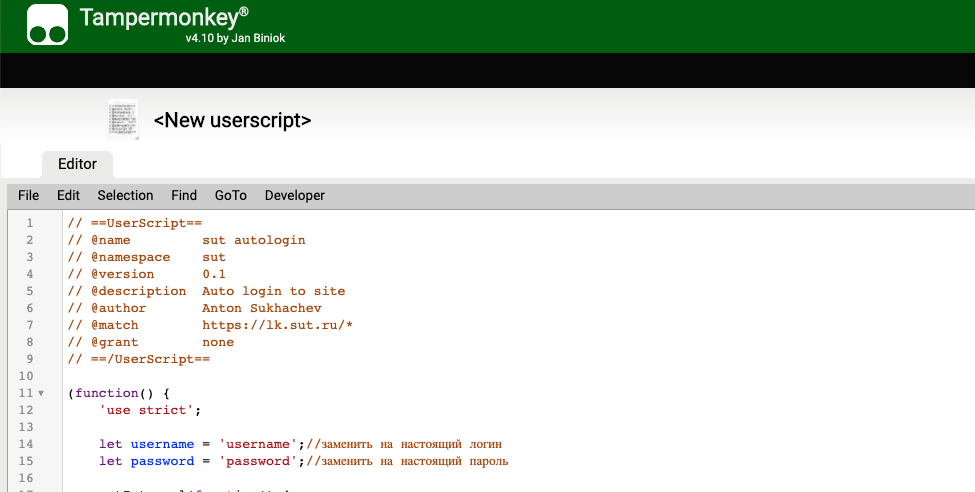
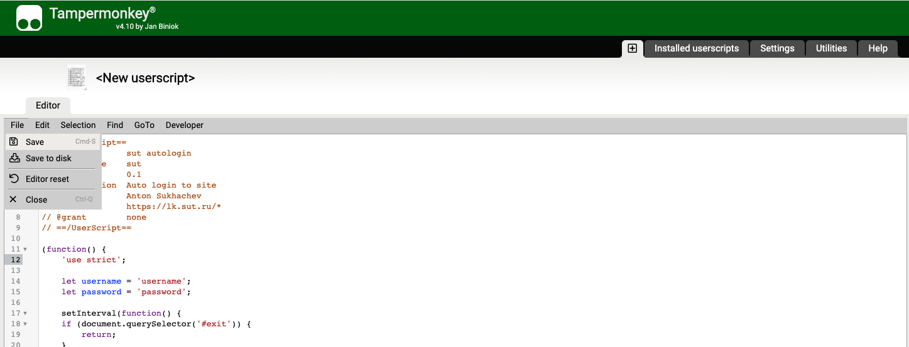
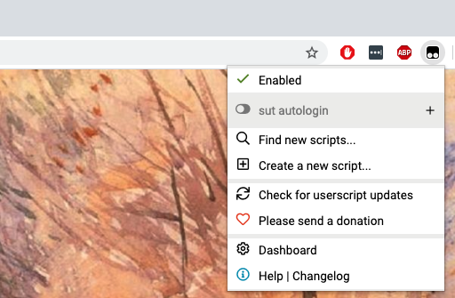

# Tampermankey lk.sut.ru autologin

Скрипт, который всегда оставляет вас залогиненым в кабинете

## Инструкция по установке

### Установить расширение для браузера Tampermankey
Перейти по ссылке браузера, которым вы пользуетесь и добавить расширение в браузер
* [Chrome](https://www.tampermonkey.net/?ext=dhdg&browser=chrome)
* [Firefox](https://www.tampermonkey.net/?ext=dhdg&browser=firefox)
* [Microsoft Edge](https://www.tampermonkey.net/?ext=dhdg&browser=edge)
* [Safari](https://www.tampermonkey.net/?ext=dhdg&browser=safari)
* [Opera Next](https://www.tampermonkey.net/?ext=dhdg&browser=opera)
* [Dolphin Browser](https://www.tampermonkey.net/?ext=dhdg&browser=dolphin)
* [UC Browser](https://www.tampermonkey.net/?ext=dhdg&browser=ucweb)

### Добавить новый скрипт
В строке расширений браузера должна появиться новая иконка Tampermankey 
Необходимо кликнуть на неё и выбрать пункт `Create a new script...` 

### Скопировать скрипт и заменить логин и пароль

* Скопировать текст скрипита [отсюда](https://raw.githubusercontent.com/mrsuh/lk-sut-tampermonkey/master/script.js)
* Вставить его в редактор Tampermankey
* Заменить логин и пароль на настоящие

### Сохранить новый скрипт
В левом верхнем меню углу редактора Tampermankey кликнуть `File` -> `Save`

### Перейти на страницу кабинета
* Скрипт уже начал работать
* Когда вы перейдете на страницу он должен вас автоматически залогинить
* Если кабинет вас разлогинет или вы сами выйдите из кабинета - скрипт автоматически залогинит вас обратно

https://lk.sut.ru/cabinet/

### Временно отключить скрипт
* В строке расширений браузера кликнуть на иконку Tampermankey 
* Отключить скрипт

